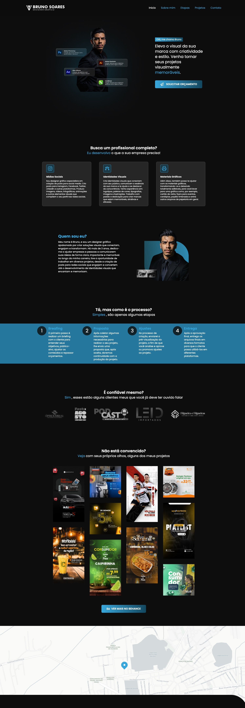

# Portfólio - Bruno Soares 💼

Este repositório contém o código do portfólio pessoal de **[Bruno Soares](https://bruno-soares-portfolio.vercel.app/)**, desenvolvido para exibir seus projetos e experiências profissionais. O projeto é **proprietário** e não está disponível para uso público ou contribuições externas.

## Funcionalidades ✨

- 📱 **Design responsivo**: Totalmente adaptado para dispositivos móveis e desktops.
- 🖼️ **Galeria de projetos**: Apresentação clara e visual dos principais projetos.
- 📝 **Seção de experiências**: Exibe as principais experiências profissionais e educacionais.
- 🌐 **Links para redes sociais**: Fácil acesso aos perfis profissionais de Bruno Soares.

## Tecnologias Utilizadas 🛠️

- **HTML5** e **CSS3**: Estruturação e estilização do portfólio.
- **JavaScript**: Para interatividade e funcionalidades dinâmicas.
- **React.js**: Framework JavaScript para construção da interface do usuário.
- **Vercel**: Hospedagem do site.

## Preview 🖼️

Aqui está um exemplo da tela final do portfólio:

## Licença ⚖️
Este projeto é de propriedade de **Bruno Soares** e não está disponível para distribuição, modificação ou uso público.
